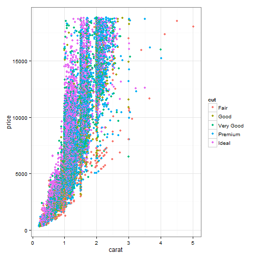
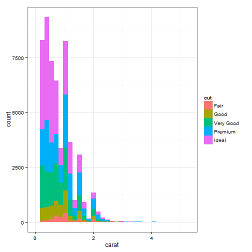

# Externalize ggplot2 code
 
You may have your own layout code like [this one](http://stackoverflow.com/q/14802183/559676), and you do not want to type the code again and again. One way to avoid repeating the code explicitly is to use chunk references. Although **knitr** is based on the idea of literate programming, but we rarely need programming, and this is one case in which literate programming may be helpful.

We simplify the layout code in the original post and put it in a code chunk named `my-layout`:


```r
theme(legend.text = element_text(size = 12)) + theme(legend.position = "bottom") + 
    theme_bw()
```


Now we can use `<<>>` to reference it.


```r
library(ggplot2)
```

```
## Warning: package 'ggplot2' was built under R version 3.0.3
```

```r
qplot(carat, price, data = diamonds, color = cut) + theme(legend.text = element_text(size = 12)) + 
    theme(legend.position = "bottom") + theme_bw()
```

 


Another test:


```r
qplot(carat, data = diamonds, fill = cut) + theme(legend.text = element_text(size = 12)) + 
    theme(legend.position = "bottom") + theme_bw()
```

```
## stat_bin: binwidth defaulted to range/30. Use 'binwidth = x' to adjust this.
```

 

