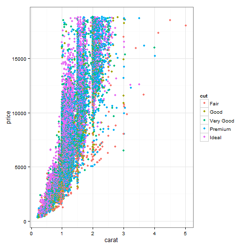
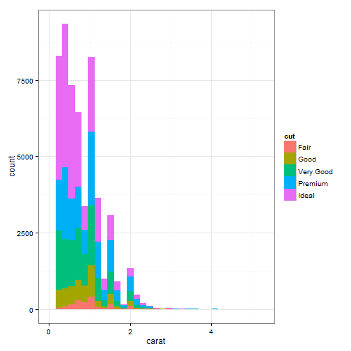

Long Island Marsh Elevation Summary
========================================================


```
## Loading required package: xtable
```

<!-- html table generated in R 3.0.2 by xtable 1.7-3 package -->
<!-- Thu Apr 03 10:56:26 2014 -->
<TABLE border=1>
<CAPTION ALIGN="bottom"> SET Monitoring sites average elevation change (mm/year +/- SE) </CAPTION>
<TR> <TH>  </TH> <TH> Site_Name </TH> <TH> Stratafication </TH> <TH> Sample N </TH> <TH> Mean_Accretion_Rate </TH> <TH> SE_ofmeanAccrate </TH> <TH> Mean_elevation_change </TH> <TH> SE_ofmeanrate </TH> <TH> SubSurface_change </TH>  </TR>
  <TR> <TD align="right"> 1 </TD> <TD> Accobonac Harbor </TD> <TD> Low Marsh </TD> <TD align="right"> 14 </TD> <TD align="right"> 2.4 </TD> <TD align="right"> 0.3 </TD> <TD align="right"> 3.1 </TD> <TD align="right"> 0.3 </TD> <TD align="right"> 0.7 </TD> </TR>
  <TR> <TD align="right"> 2 </TD> <TD> Bass Creek </TD> <TD> Low Marsh </TD> <TD align="right"> 15 </TD> <TD align="right"> 5.5 </TD> <TD align="right"> 0.3 </TD> <TD align="right"> 3.5 </TD> <TD align="right"> 1.6 </TD> <TD align="right"> -2.1 </TD> </TR>
  <TR> <TD align="right"> 3 </TD> <TD> Cedar Beach </TD> <TD> Low Marsh </TD> <TD align="right">  9 </TD> <TD align="right"> 8.7 </TD> <TD align="right"> 0.4 </TD> <TD align="right"> 3.8 </TD> <TD align="right"> 1.7 </TD> <TD align="right"> -4.9 </TD> </TR>
  <TR> <TD align="right"> 4 </TD> <TD> Hubbard Creek </TD> <TD> Low Marsh </TD> <TD align="right"> 13 </TD> <TD align="right"> 4.1 </TD> <TD align="right"> 0.7 </TD> <TD align="right"> 3.2 </TD> <TD align="right"> 0.4 </TD> <TD align="right"> -0.9 </TD> </TR>
  <TR> <TD align="right"> 5 </TD> <TD> Indian Island </TD> <TD> High Marsh </TD> <TD align="right">  9 </TD> <TD align="right"> 2.7 </TD> <TD align="right"> 0.7 </TD> <TD align="right"> 2.6 </TD> <TD align="right"> 0.2 </TD> <TD align="right"> -0.2 </TD> </TR>
  <TR> <TD align="right"> 6 </TD> <TD> Indian Island </TD> <TD> Low Marsh </TD> <TD align="right">  9 </TD> <TD align="right"> 4.5 </TD> <TD align="right"> 0.2 </TD> <TD align="right"> 3.7 </TD> <TD align="right"> 0.1 </TD> <TD align="right"> -0.8 </TD> </TR>
  <TR> <TD align="right"> 7 </TD> <TD> Lawrence Marsh </TD> <TD> Low Marsh </TD> <TD align="right">  2 </TD> <TD align="right">  </TD> <TD align="right">  </TD> <TD align="right"> 4.6 </TD> <TD align="right"> 1.7 </TD> <TD align="right">  </TD> </TR>
  <TR> <TD align="right"> 8 </TD> <TD> Mashomack Point </TD> <TD> Low Marsh </TD> <TD align="right">  9 </TD> <TD align="right"> 8.0 </TD> <TD align="right"> 0.1 </TD> <TD align="right"> 4.5 </TD> <TD align="right"> 2.2 </TD> <TD align="right"> -3.5 </TD> </TR>
  <TR> <TD align="right"> 9 </TD> <TD> North Greensedge - West Hempstead </TD> <TD> Low Marsh </TD> <TD align="right">  2 </TD> <TD align="right">  </TD> <TD align="right">  </TD> <TD align="right"> 3.5 </TD> <TD align="right"> 3.0 </TD> <TD align="right">  </TD> </TR>
  <TR> <TD align="right"> 10 </TD> <TD> Pine Neck </TD> <TD> High Marsh </TD> <TD align="right">  8 </TD> <TD align="right"> 4.4 </TD> <TD align="right"> 0.4 </TD> <TD align="right"> 4.7 </TD> <TD align="right"> 0.1 </TD> <TD align="right"> 0.3 </TD> </TR>
  <TR> <TD align="right"> 11 </TD> <TD> Pine Neck </TD> <TD> Low Marsh </TD> <TD align="right">  8 </TD> <TD align="right"> 8.5 </TD> <TD align="right"> 1.5 </TD> <TD align="right"> 6.7 </TD> <TD align="right"> 0.7 </TD> <TD align="right"> -1.7 </TD> </TR>
   </TABLE>


# Externalize ggplot2 code
 
You may have your own layout code like [this one](http://stackoverflow.com/q/14802183/559676), and you do not want to type the code again and again. One way to avoid repeating the code explicitly is to use chunk references. Although **knitr** is based on the idea of literate programming, but we rarely need programming, and this is one case in which literate programming may be helpful.

We simplify the layout code in the original post and put it in a code chunk named `my-layout`:


Now we can use `<<>>` to reference it.


```r
library(ggplot2)
```

```
## Warning: package 'ggplot2' was built under R version 3.0.3
```

```r
qplot(carat, price, data = diamonds, color = cut) + theme(legend.text = element_text(size = 12)) + 
    theme(legend.position = "bottom") + theme_bw()
```

 


Another test:


```r
qplot(carat, data = diamonds, fill = cut) + theme(legend.text = element_text(size = 12)) + 
    theme(legend.position = "bottom") + theme_bw()
```

```
## stat_bin: binwidth defaulted to range/30. Use 'binwidth = x' to adjust this.
```

 

